# StockBook - A Financial Informative Website For Stock Markets

## Author
Massimo Ranalli

## Introduction

StockBook is a platform where user can obtain the main financial insights on listed equities. It allows to get precise, critical and live data to assess the current valuation of a company. Users are also encouraged to leave comments and sentiments about stocks, in order to create an overall social sentiment, interest and community.

StockBook is a Full Stack Web Application that uses the Django Framework to manage user authentication, comment CRUD, data reception via API and data storage.

The main drive to create this project comes from my passion for finance and investing. I am a very active user of similar applications and I have always been fascinated by the capabilities that coding allows to reach in this field. In Finance, significant and fast data paves the way for a good investing performance.

## Demo

A live demo of the website can be found <a href="https://stockbook22.herokuapp.com/"><strong>HERE</strong></a> 

---

---

## Version Control 
Github was used to track the progress of this project. The very initial commitments were on a <a href="https://github.com/MaxRan92/FinBlog"><strong>previous repository</strong></a>, whose database ended up being compromised. I opted for restarting the project due to time contraints and all the commits may be found <a href="https://github.com/MaxRan92/StockBook/commits/main"><strong>here</strong></a>.
The issue has now been addressed (accidentally populated additional index field in database with same value string), and I am currenty doing research to understand how to solve it. 

## User Experience (UX)

* ### Vision  
    StockBook seeks to condense a company's fundamentals, stock performance and community sentiment in one website. To do so, key performance indicators, live data and time series must be represented accessing certified data providers. The website should be intuitive and the sometimes big amount of data should be displayed in a clear, schematic and understandable way.
    Users should be inspired and encouraged to give recommendations, which will create indicators useful to understand the overall community sentiment.

* ### Aims
    The primary aim is to provide users with an useful tool to analyse and judge a company valuation in few moments. Moreover users should be not only data receiver, but also recommendation maker. The website provides quantitative data, the community responds with qualitative comments.

* ### Target Audience
    StockBook's target audience comprises both stock markets experts and investing beginners. However, a basic knowledge of financial instruments and indicators is required to fully understand the indicators displayed.

* ### User Stories
 1. As a **Site User** I can **View a list of stocks** so that **I can decide the stock to analyse**
 2. As a **Site User** I can **register on the site** so that **I can post comments and interact**
 3. As a **Site User** I can **go to the About page** so that **I can get more general information about the site**
 4. As a **Site User** I can **click on a stock name** so that **I can go to its detailed page**
 5. As a **Site User** I can **see the live price data of the stock** so that **I can be always updated**
 6. As a **Site User** I can **see the stock price chart** so that **I can have an idea about past performance** 
 7. As a **Site User** I can **see fundamental data of the stock** so that **I can judge its valuation**
 8. As a **Site User** I can **view sentiment analysis with main figures** so that **understand the sentiment on the stock**
 9. As a **Site User** I can **view comments under each stock** so that **I can read other users opinions**
 10. As a **Site User** I can **post a comment** so that **I can interact with other users**
 11. As a **Site User** I can **post a Bullish/Bearish/Hold sentiment with the comment** so that **I can express my sentiment**
 12. As a **Site User** I can **update a comment** so that **I can amend mistakes or change opinion**
 13. As a **Site User** I can **delete my comments** so that **I can delete ideas I do not support anymore**
 14. As a **Site Admin** I can **write the description and the main information of a stock, with the possibility to keep it as a draft** so that **I can finish writing later and/or I can publish it**
 15. As a **Site Admin** I can **approve comments** so that **they can be displayed on the site**

## Design

 * ### Structure

     - Home: the landing page of the site, containing the stocks featured in the site represented with proper cards in a bootstrap grid system. Each card contains the logo of the company, its name and a brief summary. 
     - Stock Detail: the page that contains all the insights about the selected stocks:
       - Logo
       - Long description of the stock
       - Live trade price data
       - YTD historical performance chart
       - Fundamentals cards
       - Comment section

* ### Wireframes

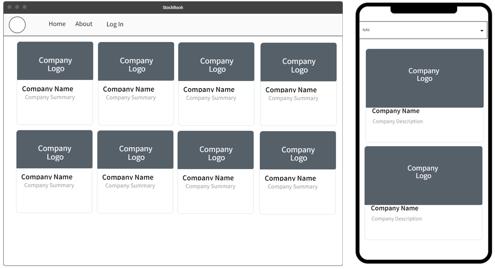
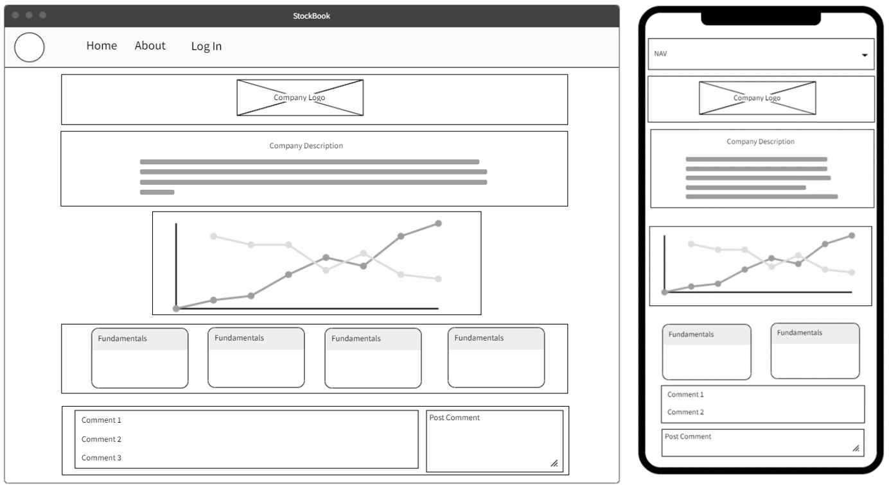

* ### Colour palette
   The palette of colors is as shown below. The primary colours used are light grey, dark grey and yellow. Blue is used for some secondary details (Graph, links). 
   The colour palette is not aggressive on the look of the web pages, to allow users to focus on data and information details. Moreover, vivaciousness is added by the numerous company logos and by the two main images, hence the final result is not dull.

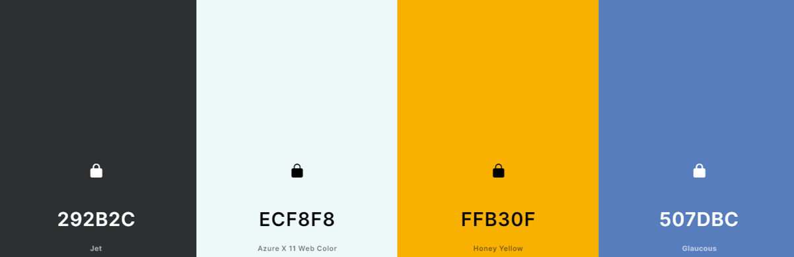

* ### Icons

    The Icons used are created with the help of the following sites:
    - [fontawesome](https://fontawesome.com/start)
    - [favicon](https://www.favicon.io/) 

## Data Models

* ### StockInfo
This data model is used to store all the relevant information about a listed stock:

| Field       | Data Type         | Purpose                          | Form Validation                  |
|-------------|-------------------|----------------------------------|----------------------------------|
| pk          | unique Identifier |                                  |                                  |
| title       | CharField         | Company Name                     | required, max length 200, unique |
| ticker      | CharField         | Official ticker of the company   | required, max lenght 6, unique   |
| slug        | SlugField         | Urls                             | required, unique                 |
| author      | ForeignKey        | Stores the author of the update  | required                         |
| updated_on  | DateTimeField     | Timestamp of the update          | automatic                        |
| description | TextField         | Business Description             | required                         |
| logo_image  | CloudinaryField   | To store company logo            | not required                     |
| excerpt     | TextField         | Business summary                 | not required                     |
| created_on  | DateTimeField     | Timestamp of the creation        | automatic                        |
| status      | IntegerField      | Draft vs Published               | required, default is Draft       |

* ### Comment
This data model is used to store the comments of the users along with their sentiment:

| Field       | Data Type         | Purpose                          | Form Validation                  |
|-------------|-------------------|----------------------------------|----------------------------------|
| pk          | unique Identifier |                                  |                                  |
| stock       | ForeignKey        | One to many relation w/StockInfo | required but automatic           |
| name        | CharField         | To be shown below comment        | required but automatic           |
| email       | EmailField        | To be stored in database         | required but automatic           |
| body        | TextField         | To be shown, it is the comment   | required                         |
| created_on  | DateTimeField     | To be shown below the comment    | required but automatic           |
| approved    | BooleanField      | admin approve befor publishing   | required, auto is False (*)      |
| sentiment   | CharField         | To express the sentiment         | required, default is HOLD        |

(*) Please notice that in the current version and for better interactivity of the users, also not approved comments are shown in the site.
The original version with comments to be approved to appear may be retrieved from initial commits.

- [x] Create - Every registered and logged in user can post a comment with sentimenti in the page of a specific stock
- [x] Read - Every user can read the comments of other users
- [x] Update - Every registered and logged in user can edit a comment posted by himself
- [x] Delete - Every registered and logged in user can delete a comment posted by himself

## Features

* ### Navigation Bar:
The navigation bar is intuitive: users can always return to the home page, which shows the list of published stocks. Moreover, user can go to the about page to view general information and can login or register if logged out, or log out if logged in.

* ### Home Page - Stock list
In the homepage the user receives a welcome to the site and can view all the featured stocks, scrolling down or going to next or previous page.
Each stock is represented by a card showing its logo, name and brief summary. 
By clicking on a card of a stock, the page links to its Stocks Detail Page.

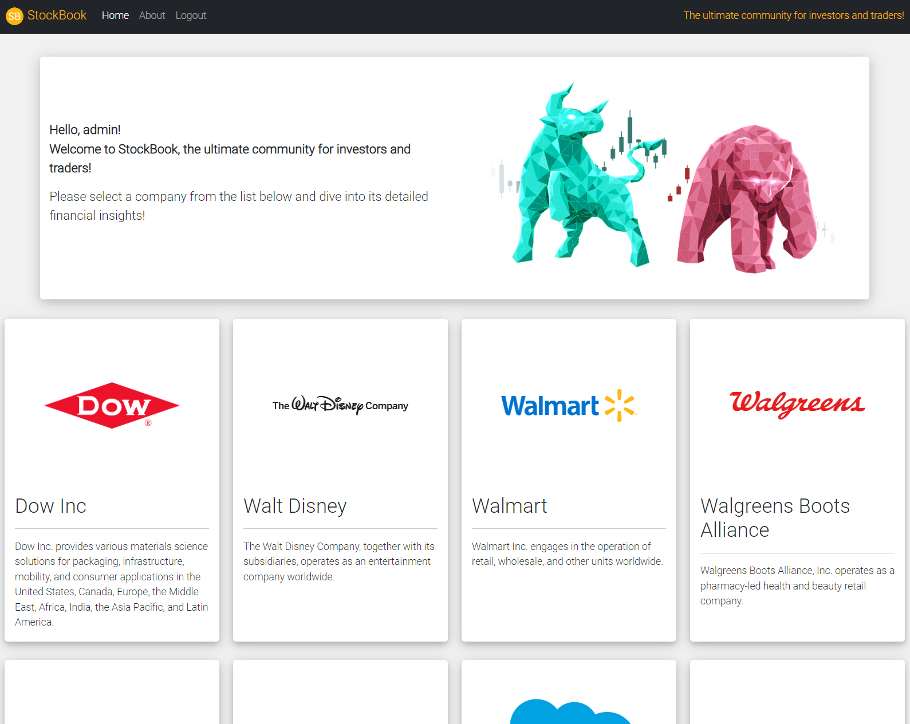

* ### Stock Detail Page
Here the user can find the following sections:

 - Main Data Section and Company description: name of the stock, ticker, last price and daily performance, currency, last price update and long company description.

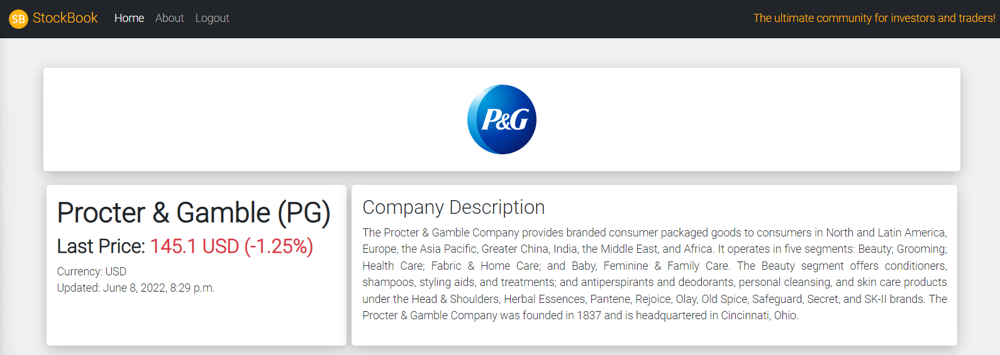

 - YTD Price Chart, with the time series of the YTD prices
 - Fundamental Data, a section hosting useful data grouped in Overview, Financials, Multiples and Sentiment

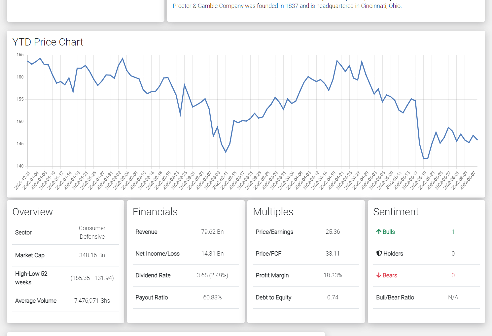

 - Comments, in which the user can see all the comments of the stock. 
 Moreover, if logged in a user can post a comment through the specific form, or edit and delete (own) comments through a button. These active actions of the user are always followed by a confirmation message on the message form.

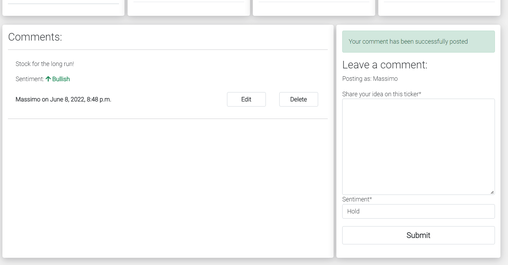

* ### About Page
A page in which the user can gather general information about the features of the site.

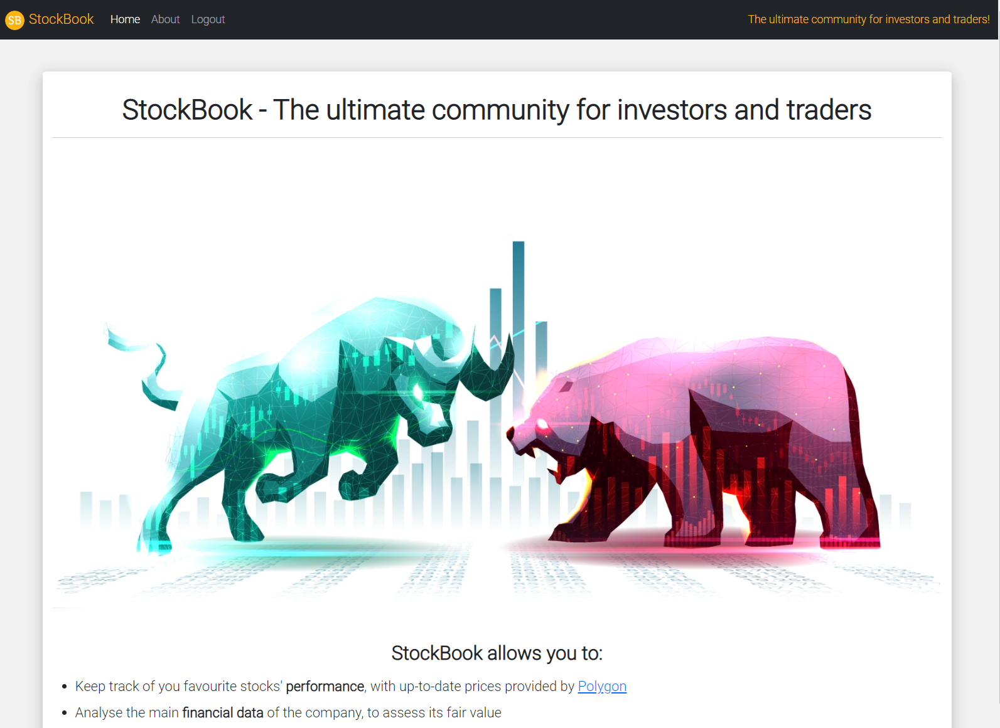

* ### Register, Log in, Log out pages
These pages are used for user authentication and they all return messages when actions are completed.

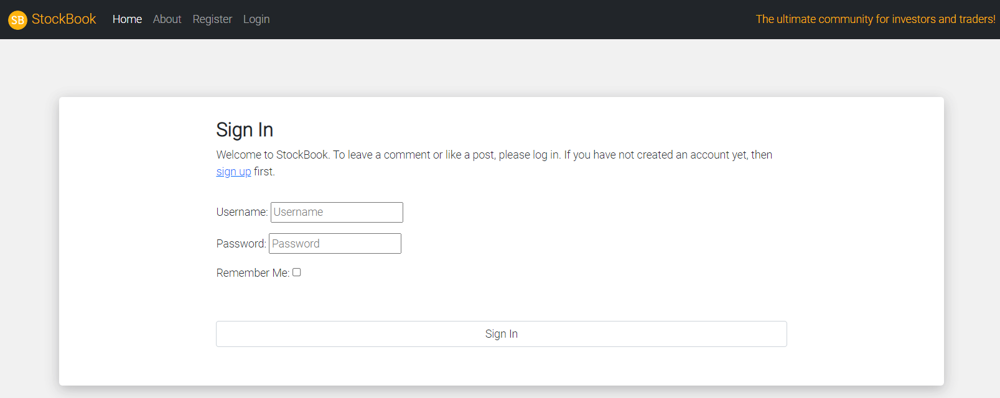

## API and data provider used

* ### Market Prices - Polygon
To retrieve live market data, I have made a subscription to the <a href="https://polygon.io"><strong>Polygon</strong></a>. With the package provided, Stockbook is able to get Last Trades Prices with a delay of 15 mins, along with their trade timestamps.  

* ### Stock Fundamentals - YFinance Library
To get all the fundamental data of the stock (Multiples, Financials, etc.), I used the <a href="https://pypi.org/project/yfinance/"><strong>yfinance</strong></a> library that replicates the data of Yahoo Finance, made by Ran Aroussi. It is free to use and quite complete, although missing live market data.

## Testing

### Lighthouse Audit 
All the pages receive scores higher than 90 in SEO, Accessibility and Best Practices.
Performance sometimes has a score around 80 because some pictures are in high resolution. API calls may add some time to the page loading. Given this, the performance of the site looks still solid.

### Validator Testing 
* ### W3C CSS Validation 
CSS code passed through the CSS validator with no errors.
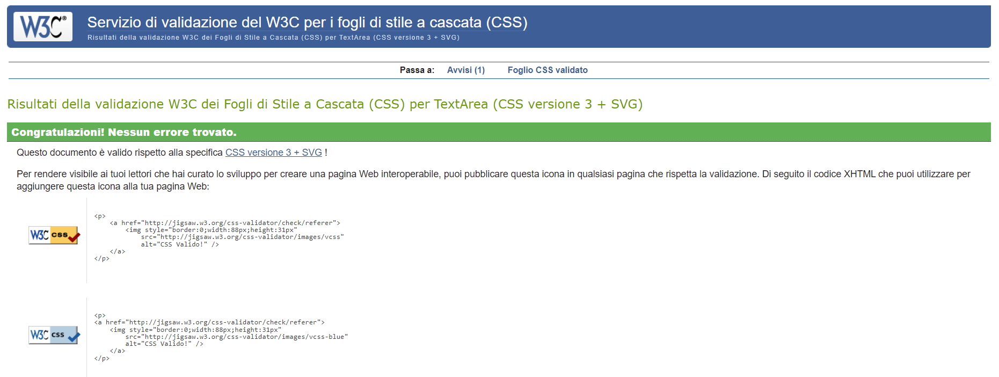

* ### HTML Validator 
All HTML pages' code passed through HTML Validator with no errors.
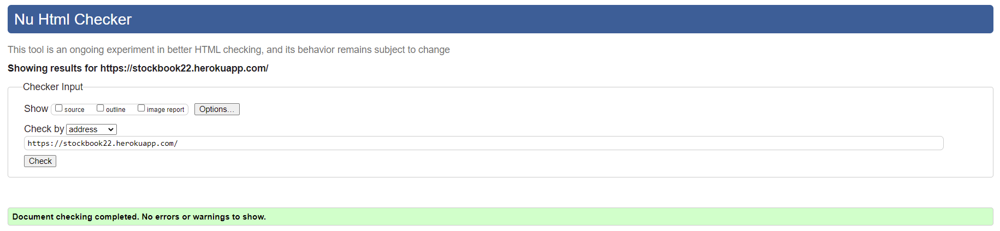

* ### PEP8 Validator
All python files passed through PEP8 with no errors. 
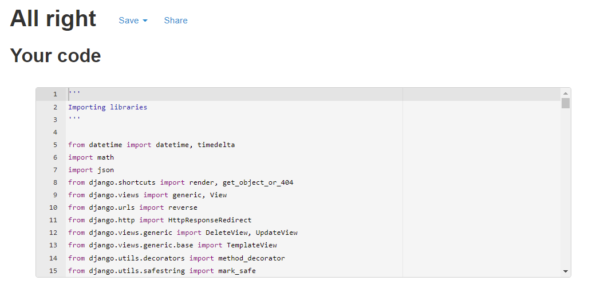

* ### Cross Browser and Device Testing
    - The site has been tested on multiple devices sceen sizes with the proper Chrome emulator. All the elements of the pages are rendered properly and are full responsive.
    - Moreover, the website has been tested on Safari, Chrome and Firefox.

    The Bootstrap5 Grid System has been largely used in the HTML code, greatly facilitating the development of responsive pages.

#### Navigation

TESTING TO BE INSERTED HERE

## Future Features:

* ### Stock Screener
One of the most powerful development for StockBook would be a stock screener. Users can select performance, fundamental or sentiment paramenters as filters to find the best opportunities. 

* ### Watchlist
Another great feature would be the possibility to add any stock to favourites, in order to create watchlists with main market data. In this way, the user can easily view the live performance the stocks of interest.

* ### Portfolio
A more complex development would be the implementation of a portfolio functionality: users can add their holdings at a certain point in time in order to retrieve useful insights about the portfolio. This development would represent a big step in terms of complexity of the calculations and data storage/management.

* ### News Feed
Every Stock Detail page could have a news feed with all the relevant news regarding the ticker, provided via API.

