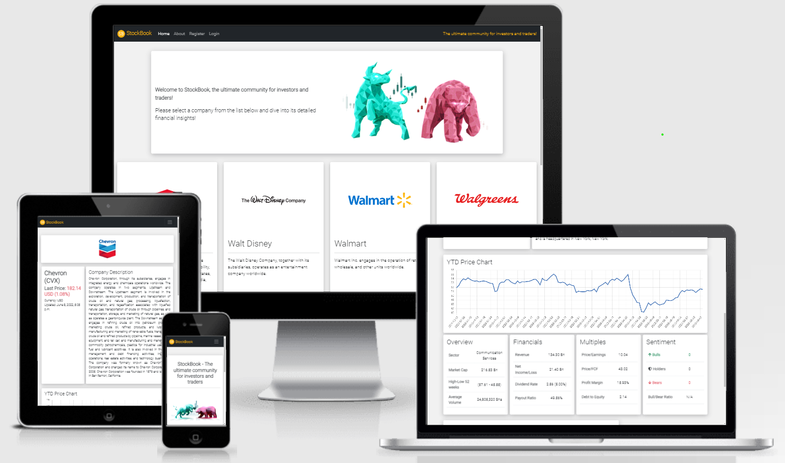

# StockBook - A Financial Informative Website For Stock Markets

## Introduction

StockBook is a platform where user can obtain the main financial insights on listed equities. It allows to get precise, critical and live data to assess the current valuation of a company. Users are also encouraged to leave comments and sentiments about stocks, in order to create an overall social sentiment, interest and community.

StockBook is a Full Stack Web Application that uses the Django Framework to manage user authentication, comment CRUD, data reception via API and data storage.

The main drive to create this project comes from my passion for finance and investing. I am a very active user of similar applications and I have always been fascinated by the capabilities that coding allows to reach in this field. In Finance, significant and fast data paves the way for a good investing performance.

## Demo

A live demo of the website can be found <a href="https://stockbook22.herokuapp.com/"><strong>HERE</strong></a> 

---

---
