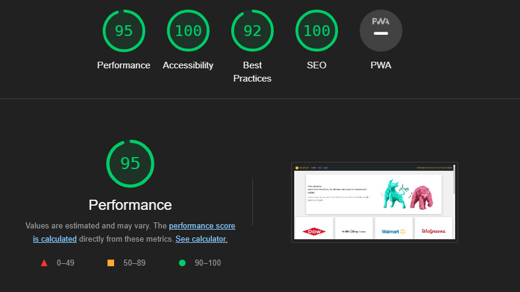

# StockBook - A Financial Informative Website For Stock Markets

## Author
Massimo Ranalli

## Introduction

StockBook is a platform where users can obtain main financial insights and data on any listed equity. It allows to get precise, critical and live data to assess the current valuation of a company. Users are also encouraged to leave comments and sentiments about stocks, in order to create an overall social sentiment, interest and community.

StockBook is a Full Stack Web Application that uses the Django Framework to manage user authentication, comment CRUD, data reception via API and data storage.

The main drive to create this project comes from my passion for finance and investing. I am a very active user of similar applications and I have always been fascinated by the capabilities that coding allows to reach in this field. In Finance, significant and fast data paves the way for a good investing performance.

## Demo

A live demo of the website can be found <a href="https://stockbook22.herokuapp.com/"><strong>HERE</strong></a> 

---

---

## Version Control 
Github was used to track the progress of this project. The very initial commitments were on a <a href="https://github.com/MaxRan92/FinBlog"><strong>previous repository</strong></a>, whose database ended up being compromised. I opted for restarting the project due to time constraints and all the commits may be found <a href="https://github.com/MaxRan92/StockBook/commits/main"><strong>here</strong></a>.
The issue has now been addressed (accidentally populated additional index field in the database with same value string), and I am currently doing a research to understand how to solve it. 

## User Experience (UX)

* ### Vision  
    StockBook seeks to condense a company's fundamentals, stock performance and community sentiment in one website. To do so, key performance indicators, live data and time series must be represented accessing certified data providers. The website should be intuitive and the sometimes big amount of data should be displayed in a clear, schematic and understandable way.
    Users should be inspired and encouraged to give recommendations, which will create indicators useful to understand the overall community sentiment.

* ### Aims
    The primary aim is to provide users with a useful tool to analyse and judge a company valuation in few moments. Moreover users should be not only data receiver, but also recommendation maker. The website provides quantitative data, the community responds with qualitative comments.

* ### Target Audience
    StockBook's target audience comprises both stock markets experts and investing beginners. However, a basic knowledge of financial instruments and indicators are required to fully understand the indicators displayed.

* ### User Stories
User stories were created and managed via GitHub <a href="https://github.com/MaxRan92/StockBook/projects/1"><strong>here</strong></a>

 1. As a **Site User** I can **View a list of stocks** so that **I can decide the stock to analyse**
 2. As a **Site User** I can **register on the site** so that **I can post comments and interact**
 3. As a **Site User** I can **go to the About page** so that **I can get more general information about the site**
 4. As a **Site User** I can **click on a stock name** so that **I can go to its detailed page**
 5. As a **Site User** I can **see the live price data of the stock** so that **I can be always updated about their quotes**
 6. As a **Site User** I can **see the stock price chart** so that **I can have an idea about past performance** 
 7. As a **Site User** I can **see fundamental data of the stock** so that **I can judge its valuation**
 8. As a **Site User** I can **view sentiment analysis with main figures** so that **I understand the sentiment on the stock**
 9. As a **Site User** I can **view comments under each stock** so that **I can read other users' opinions**
 10. As a **Site User** I can **post a comment** so that **I can interact with other users**
 11. As a **Site User** I can **post a Bullish/Bearish/Hold sentiment with the comment** so that **I can express my sentiment**
 12. As a **Site User** I can **update my comments** so that **I can amend mistakes or change opinion**
 13. As a **Site User** I can **delete my comments** so that **I can delete ideas I do not support any more**
 14. As a **Site Admin** I can **write the description and the main information of a stock, with the possibility to keep it as a draft** so that **I can finish writing later and/or I can publish it right away**
 15. As a **Site Admin** I can **approve comments** so that **they can be displayed on the site**

## Design

 * ### Structure

     - Home: the landing page of the site, containing the stocks featured in the site represented with proper cards in a bootstrap grid system. Each card contains the logo of the company, its name, and a summary. 
     - Stock Detail: the page that contains all the insights about the selected stocks, such as
       - Logo
       - Long description of the stock
       - Live trade price data
       - YTD historical performance chart
       - Fundamentals cards
       - Comment section

* ### Wireframes

* ### Colour palette
   The palette of colors is as shown below. The primary colors used are light grey, dark grey, and yellow. Blue is used for some secondary details (Graph, links). 
   The color palette is not aggressive on the look of the web pages, to allow users to focus on data and information details. Moreover, vivaciousness is added by the numerous company logos and by the two main images, hence the final result is not dull.

* ### Icons

    The Icons used are created with the help of the following sites:
    - [fontawesome](https://fontawesome.com/start)
    - [favicon](https://www.favicon.io/) 

## Data Models

* ### StockInfo
This data model is used to store all the relevant information about a listed stock:

| Field       | Data Type         | Purpose                          | Form Validation                  |
|-------------|-------------------|----------------------------------|----------------------------------|
| pk          | unique Identifier |                                  |                                  |
| title       | CharField         | Company Name                     | required, max length 200, unique |
| ticker      | CharField         | Official ticker of the company   | required, max lenght 6, unique   |
| slug        | SlugField         | Urls                             | required, unique                 |
| author      | ForeignKey        | Stores the author of the update  | required                         |
| updated_on  | DateTimeField     | Timestamp of the update          | automatic                        |
| description | TextField         | Business Description             | required                         |
| logo_image  | CloudinaryField   | To store company logo            | not required                     |
| excerpt     | TextField         | Business summary                 | not required                     |
| created_on  | DateTimeField     | Timestamp of the creation        | automatic                        |
| status      | IntegerField      | Draft vs Published               | required, default is Draft       |

- [ ] Create - Superadmin can Create stock via django administration
- [x] Read - Every user can read the stock details in their page 
- [ ] Update - Superadmin can Update stock via django administration
- [ ] Delete - Superadmin can Delete stock via django administration

* ### Comment
This data model is used to store the comments of the users along with their sentiments:

| Field       | Data Type         | Purpose                                  | Form Validation                  |
|-------------|-------------------|------------------------------------------|----------------------------------|
| pk          | unique Identifier |                                          |                                  |
| stock       | ForeignKey        | One to many relation w/StockInfo         | required but automatic           |
| name        | CharField         | To be shown below comment                | required but automatic           |
| email       | EmailField        | To be stored in database                 | required but automatic           |
| body        | TextField         | To be shown, it is the comment           | required                         |
| created_on  | DateTimeField     | To be shown below the comment            | required but automatic           |
| approved    | BooleanField      | To let admin approve before publishing   | required, auto is False (*)      |
| sentiment   | CharField         | To express the sentiment                 | required, default is HOLD        |

(*) Please notice that in the current version and for better interactivity for the users, not yet approved comments are also shown on the site.

- [x] Create - Every registered and logged in user can post a comment with sentiment in the page of a specific stock
- [x] Read - Every user can read the comments of other users
- [x] Update - Every registered and logged in user can edit a comment posted by himself
- [x] Delete - Every registered and logged in user can delete a comment posted by himself

## Features

* ### Navigation Bar:
The navigation bar is intuitive: users can always return to the home page, which shows the list of published stocks. Moreover, users can go to the about page to view general information. They can log in, register or log out.

* ### Home Page - Stock list
In the homepage the user receives a welcome message to the site and can view all the featured stocks, scrolling down or going to the following pages.
Each stock is represented by a card showing its logo, name and brief summary. 
By clicking on a stock's card, the page links to its Stocks Detail Page.

* ### Stock Detail Page
Here the user can find the following sections:

 - Main Data Section and Company description: name of the stock, ticker, last price, daily performance, currency, last price update and long company description.

 - YTD Price Chart, with the time series of the YTD prices.
 - Fundamental Data, a section hosting useful data grouped in Overview, Financials, Multiples and Sentiment cards.

 - Comments section, in which the user can see all the comments about the stock. 
 Moreover, if logged in a user can post a comment through the specific form, or edit and delete (own) comments through the appropriate buttons. These active actions of the user are always followed by a confirmation message on the comment form.

* ### About Page
A page on which the user can gather general information about the features of the site.

* ### Register, Log in, Log out pages
These pages are used for user authentication and they all return pop up messages when actions are completed.

## API data provider

* ### Market Prices - Polygon
To retrieve live market data, I have made a subscription to the <a href="https://polygon.io"><strong>Polygon</strong></a> API service. With the package provided, Stockbook is able to get Last Trades Prices with a delay of 15 minutes, along with the trade timestamps.  

* ### Stock Fundamentals - YFinance Library
To get all the fundamental data of the stock (Multiples, Financials, etc.), I used the <a href="https://pypi.org/project/yfinance/"><strong>yfinance</strong></a> library that replicates the data of Yahoo Finance, made by Ran Aroussi. It is free to use and quite complete, although missing live market data, hence the need for two different data providers.

## Frameworks

The Frameworks used in this projects are the following:

* ### Django Framework

* ### Bootstrap 5

* ### Chart.js

## Testing

### Lighthouse Audit 
All the pages received scores higher than 90 in SEO, Accessibility, and Best Practices.
Performance sometimes had a score of around 80 because some pictures are in high resolution. API calls may add some time to the page loading. Given this, the performance of the site looks still solid and page rendering is not excessively slow.

### Validator Testing 
* ### W3C CSS Validation 
CSS code successfully passed through the CSS validator with no errors.

* ### HTML Validator 
All HTML pages' code successfully passed through HTML Validator with no errors.

* ### PEP8 Validator
All python code successfully passed through PEP8 with no errors. 

* ### Cross Browser and Device Testing
    - The site has been tested on multiple devices screen sizes with the proper Chrome emulator. All the elements of the pages are rendered properly and are fully responsive. The Bootstrap5 Grid System has been largely used in the HTML code, greatly facilitating the development of responsive pages.
    - The website has been successfully tested on Safari, Chrome and Firefox.

    
## Performed Manual Testing

### Link Testing

#### Navigation
1. In the NAV bar, select the navigation options (Home, About, Register, Login, Logout and StockBook logo).
2. Click every mentioned link.
3. Ensure each link shows the assigned page. 
4. Ensure the bottom NEXT and PAGE buttons work properly.
5. Ensure the footer social links work properly.

#### Home page links
1. In the home page, click on any stock card
2. Ensure the proper page is rendered

### CRUD Comment Testing
In a sample of stock detail pages, the following tests have been performed:
1. If the user is not logged in and if no comment has been posted, the comments section invites the user to be the first one by logging in or registering, showing clickable links.
2. If the user is logged in, the comment form is showed, and user can input a free text and choose a sentiment. By clicking on the submit button, the comment is effectively added to the comment list and a pop up message appears on top of the comment form. If no text or blank spaces are submitted, the form invites the user to fill it properly. 
3. If the user is logged in and there is one of his comments in the comment list, EDIT and DELETE buttons are showed.
4. If the EDIT button is clicked, the page successfully links to a edit form. Once the amendments are made, they are submitted and showed properly, with a pop up message on top of the comment form.
5. If the DELETE button is clicked, the page successfully links to a delete form that asks the user to confirm or to go back to homepage. If the deletion is confirmed, the comment is effectively deleted, with a pop up success message on top of the comment form.

### Authentication Testing
1. If the user is not logged in, the NAV bar shows the REGISTER and the LOGIN links.
2. The REGISTER link leads to the register form, in which a client compiles with username, email (optional), password, and password confirmation.
3. If the username is already taken, the sign-up will not proceed and the user is properly notified.
4. If the password does not match, is empty, is too common (no special characters) or is too short, the sign-up will not proceed and the user is properly notified.
5. If the form is compiled properly, the account will be made and the new user is redirected to the homepage, with a pop up message on top of the page.
6. The LOGIN link leads to the Sign In form, in which username and password are required. If these fields are empty or do not match with the database, the sign-in will not proceed and the user is properly notified.
7. If the form is compiled properly, the user will be logged in and will be redirected to the homepage, with a pop up message on top of the page.
8. If the user is logged in, the NAV bar shows the LOGOUT link, which leads to the sign-out confirmation form. If the user confirms, he is effectively signed out.

### Polygon API Testing
1. If API_KEY is empty or wrong, a BadResponse is generated and the code handles the error by not showing the chart in the stock detail page and by showing a "site under maintenance" message.
2. The same response is given if ConnectionError, Timeout, TooManyRedirects, RequestException and HTTPError occur, and if the ticker of the stock does not exist.   

### YFinance Testing
1. If Yfinance call returns ConnectionError, AttributeError, Timeout, TooManyRedirects, RequestException, HTTPError, exceptions.BadResponse, or if it returns empty string, the Fundamental data area is not shown.

2. YFinance .stats() data call, largely used in the website, returns a long dictionary of data. Used dictionary values are called via their key string, and the main error risks come from the unexpected change of these keywords from the data provider. Manual testing has been made with fake keys, and errors has been handled so that the fundamental data cards will render those improperly called data with a dash.   

3. Lastly, if the ticker of the stock does not correspond to any quoted stock, all these data fields will be set to "-".

### Automated Testing
No automated testing was achieved at this time.

## Defects

Here are some defects encountered during the development of the website:

 - API Error management: both Polygon and Yfinance can raise different kinds of errors due to wrong API, data not existing or empty, change in the data structure provided. As described above, these defects where managed via proper error handling and the manual testing resulted in no bad website response.

 - In one of the first migrations for the database, I added fields to existing data, populating them in bulk via Gitpod terminal with the same string character. Unfortunately this compromised the data model and I had to restart the project. Further research will be made in order to find a better solution in case such an issue will occur again.

 - In the first attempts to import data in the stock price chart, chart.js turned out to not accept pandas dataframe as a viable input. The issue was resolved by converting the pandas dataframe to a json object via json.dump(). 

## Future Features:

* ### Chart Time Interval Selection
One of the first features I would like to implement is the possibility to select different time intervals for the stock price chart.

* ### Timezone choice
All the live market data are in UTC time zone. A future useful feature would be to give the possibility to the user to choose a time zone during his registration, so that the timestamps can be all converted accordingly.

* ### Stock Screener
One of the most powerful development for StockBook would be a stock screener. Users can select performance, fundamental or sentiment paramenters as filters to find the best opportunities. 

* ### Watchlist
Another great feature would be the possibility to add any stock to favorites, in order to create watchlists with main market data. In this way, the user can easily view the live performance of his favorites stocks.

* ### News Feed
Every Stock Detail page could have a news feed with all the relevant news regarding the ticker, provided via API.

* ### Portfolio
A more complex development would be the implementation of a portfolio functionality: users can add their holdings at a certain point in time in order to retrieve useful insights about the portfolio and its historical performance. This development would represent a big step in terms of complexity of the calculations and data storage/management, and will be the last one to be attempted.

## Deployments 

### Local 

- Step 1: Go the GitHub repo: https://github.com/MaxRan92/StockBook

- Step 2: Press the green Gitpod button. 

- Step 3: If needed, Upgrade pip locally with: pip3 install --upgrade pip

- Step 4: Create a new .env file by typing: touch env.py and put the below values into the file.
  - os.environ["DATABASE_URL"] = "YOUR_VALUE"
  - os.environ["SECRET_KEY"] = "YOUR_VALUE"
  - os.environ["CLOUDINARY_URL"] = "YOUR_VALUE" 
  - Please notice you should also insert a poligon API key: os.environ["POLYGON_API_KEY"] = "--API KEY--". Unfortunately the service is premium and data will not be downloaded without a <a href="https://polygon.io/pricing"><strong>Developer subscription</strong></a> and a proper key. In any case, the code is tested and able to manage the absence of an API key and all the remaining functionalities will remain active.

- Step 5: Install all requirements by typing: pip3 install -r requirements.txt into your terminal. 

- Step 6: Create the superuser so you can have access to the django admin, follow the steps necessary to set up the username, email and password by running the following management command in your terminal: python manage.py createsuperuser

- Step 7: Start your server by running the following management command in your terminal: python3 manage.py runserver

### Heroku 

The site was deployed to Heroku. The steps to deploy are as follows: 

  - First, log into Heroku and create a new app.
  
  - Click on the 'Resources' tab and search for 'Heroku Postgres' as this is the add-on you will use for the deployed database.

  - Once the app is created, go into the 'Settings' tab. 
  
  - From here, go to the 'Config Vars section'. 

  
  
  - You then enter the keys and (yours) values for CLOUDINARY_URL, DATABASE_URL, SECRET_KEY and POLYGON_API_KEY. 
  
  - After finishing you are ready to deploy. There is the proper functionality in the 'deploy' tab, but this needs prior GitHub connection. Unfortunately, as of the date of this writing, the GitHub connection is not functioning.

  - To solve it, you can deploy via Gitpod terminal. To do so:
     - Log in your Heroku account from GitPod, entering: "heroku login -i"
     - Once authenticated, enter: "heroku git:remote -a {app_name}", where app_name is the name given on Heroku to the app just created.
     - Add and commit any changes to the code, if applicable.
     - Push both to GitHub and Heroku entering the following commands:
       - "git push origin main"
       - "git push heroku main"
  
  
  - Go back to the App page on Heroku, press "More" on the top right corner to monitor the deployment logs.

  - Once the deployment is finished, you should be able to see the site clicking on 'Open app' on the top right corner of the page.

  ## Credits

### Media Credits
- Images for companies were found on: <a href="https://wikipedia.org/"><strong>Wikipedia</strong></a>
- Images for site (About and Home pages) were found on: <a href="https://freepik.com/"><strong>Freepik</strong></a>
### Content Credits
- All the description and data are provided by <a href="https://polygon.io"><strong>Polygon</strong></a> and <a href="https://pypi.org/project/yfinance/"><strong>Yfinance</strong></a> APIs.

### Code Credits 
- The code structure is based on the material provided during the <a href="https://codeinstitute.net/global/"><strong>Code Institute</strong></a> course, especially from the CodeStar walkthrough project.
- The stock price chart was made with the essential help of <a href="https://www.chartjs.org/"><strong>Chart.js</strong></a> documentation. 
- Other minor code credits are displayed as comments in the website code.

 
## Acknowledgments
A special thank to:
- My mentor <a href="https://github.com/maliahavlicek"><strong>Malia</strong></a> for her help, motivation and belief in my capabilities.
- My family and my partner, for their patience and support demonstrated during the project 
